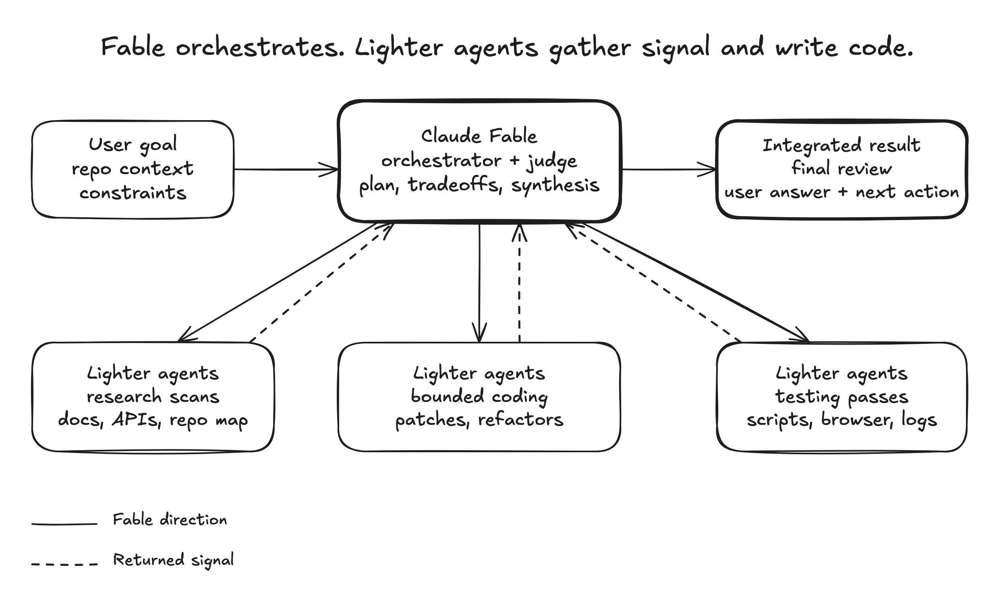

# Skills for coding agents

> **⚠️ Archived / moved.** These skills now live (improved) in the
> [`oliphant-plugins`](https://github.com/JoshuaOliphant/claude-plugins) marketplace
> as the `agent-skills` plugin. This repository is no longer maintained.

Small, composable skills for coding agents.

These skills are for teams that want the agent to stay sharp where judgment
matters: orchestration, review, planning, validation, docs discipline, and clear
communication. They are not a giant process framework. Install the pieces you
want, adapt them to your project, and let the model keep room to think.

## Skills

### [`/visual-plan`](skills/visual-plan/README.md)

Turn ordinary text plans into rich interactive visual plans with diagrams, file
maps, annotated code, open questions, and UI/prototype review when useful.

Solves for plans that are too important to bury in chat. The output is
scannable, commentable, and intuitive enough for a human to approve before code
changes start.

<picture>
  
</picture>

Produces a self-contained `plan.html` you open locally — no account, no server, no external services.

### [`/visual-recap`](skills/visual-recap/README.md)

Turn a branch, commit, or PR diff into an interactive visual recap with
annotated diffs, diagrams, API/schema summaries, file maps, UI state summaries,
and focused review notes.

Solves for diffs that hide the shape of the change. Reviewers can understand
contracts, architecture moves, schema changes, and UI impact before diving into
raw line-by-line review.

<picture>
  
</picture>

Produces a self-contained `recap.html` from a branch/PR/commit diff, opened locally.

### [`/agent-watchdog`](skills/agent-watchdog/README.md)

Audit another agent's work from a Codex session, Claude Code transcript, PR,
branch, or run summary.

Solves for cross-agent handoffs: watch until done, reconstruct what was asked,
check what actually changed and verified, report gaps, and optionally make
narrow fixes.

### [`/plan-arbiter`](skills/plan-arbiter/README.md)

Compare competing agent plans and choose one executable direction.

Solves for multi-agent planning loops where Codex, Claude Code, or other agents
produce separate strategies. The output is a decision memo with the winning or
hybrid plan, rejected alternatives, verification gates, and executor
recommendation.

### [`/plow-ahead`](skills/plow-ahead/README.md)

Keep working through ordinary ambiguity and finish with a clear decision recap.

Solves for explicit autonomy requests: the agent converts routine questions into
assumptions, proceeds with conservative choices, validates the work, and recaps
the decisions it made without stopping.

### [`/efficient-fable`](skills/efficient-fable/README.md)

Use Claude Fable as the orchestrator, architect, synthesizer, and final judge
while lighter agents handle token-heavy research, coding, testing, and log
reduction.

Solves for expensive-model waste: Fable should spend tokens on judgment, not on
reading every file, reducing every log, or manually running every browser check.

<picture>
  <source media="(prefers-color-scheme: dark)" srcset="skills/efficient-fable/assets/fable-orchestrator-dark.png">
  <source media="(prefers-color-scheme: light)" srcset="skills/efficient-fable/assets/fable-orchestrator.png">
  
</picture>

### [`/efficient-frontier`](skills/efficient-frontier/README.md)

Apply the same orchestration as `/efficient-fable` to any high-cost frontier
model: preserve the expensive model for planning, tradeoffs, integration,
validation strategy, and final review; use cheaper agents for bounded heavy
lifting.

Solves for broad work that can be parallelized without asking the most expensive
model to do every scan and every edit itself.

### [`/stay-within-limits`](skills/stay-within-limits/README.md)

Check current 5-hour and weekly usage before substantial work and between
parallel waves, then pause new execution at 95% until the active window is clear
enough to continue.

Solves for long-running agent sessions that accidentally exhaust the current
budget window mid-task instead of pausing cleanly and resuming with a
self-contained plan.

### [`/quick-recap`](skills/quick-recap/README.md)

Add a concise final status block convention so every completed response ends
with a clear green, yellow, or red work-state signal.

Solves for ambiguity at the end of agent work: done, pending a specific
non-routine step, or blocked on the user.

Example green status:

```md
🟢 Updated quick recap docs with output examples
```

Example yellow status:

```md
🟡 Code updated, set PROVIDER_WEBHOOK_SECRET before testing webhooks
```

### [`/read-the-damn-docs`](skills/read-the-damn-docs/README.md)

Make agents web-search for authoritative docs before they guess from stale model
memory.

Solves for version drift and API folklore: package installs, framework config,
SDK imports, provider limits, auth, security, billing, data, migrations, deploys,
and repo-specific contracts all require a docs pass before implementation. For
external APIs and current product behavior, web search for official docs is
usually the first move.

## Install

Install as a Claude Code plugin marketplace from this repository:

```sh
/plugin marketplace add joshuaoliphant/agent-skills
/plugin install agent-skills@agent-skills
```

Skills are then namespaced under the plugin (for example, `/agent-skills:quick-recap`). Pull updates with:

```sh
/plugin marketplace update agent-skills
```

You can also copy a `skills/<name>/` folder directly into your agent's skills directory. (`visual-recap` shares its reference docs with `visual-plan`, so copy both of those together.)

> Forked from https://github.com/BuilderIO/skills and de-coupled to run fully locally. <!-- provenance -->
